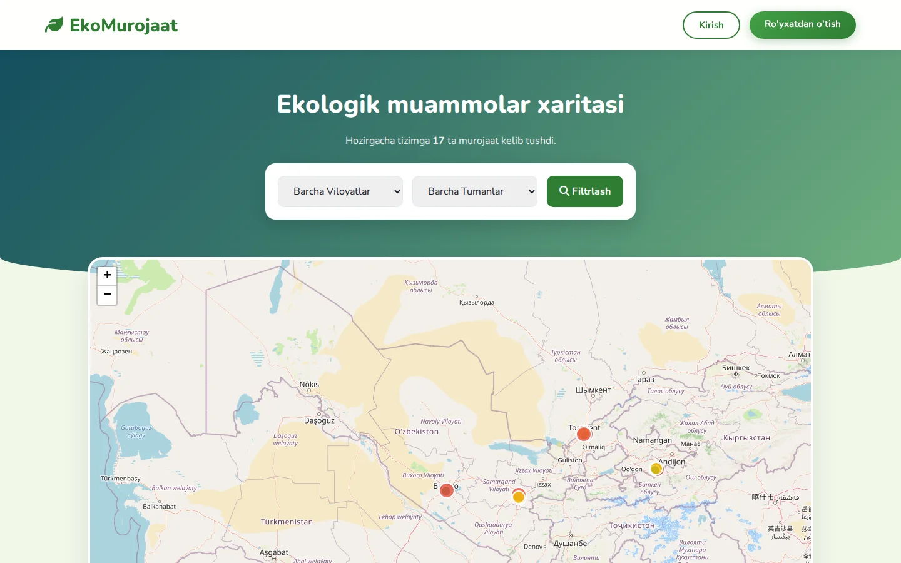
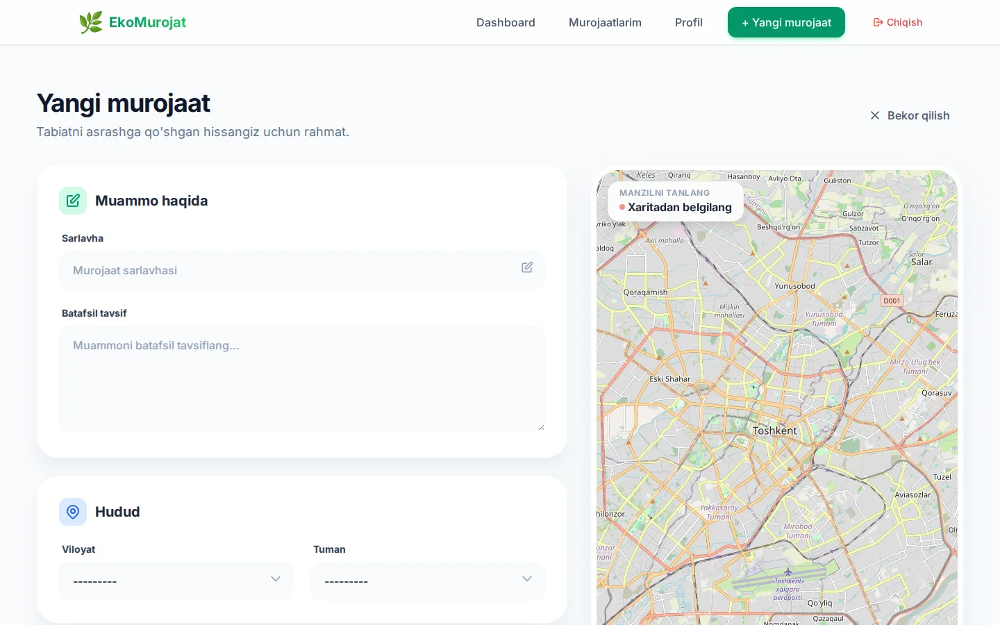
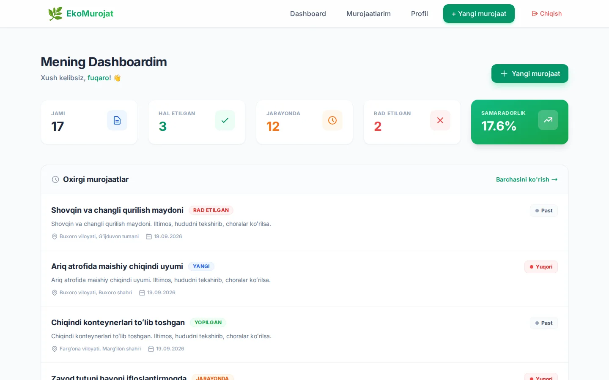
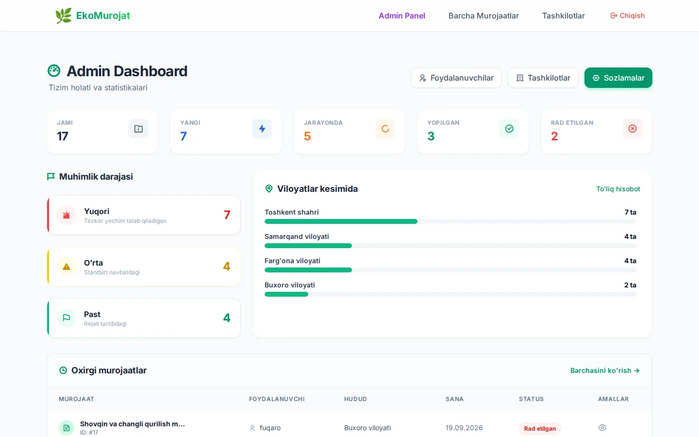
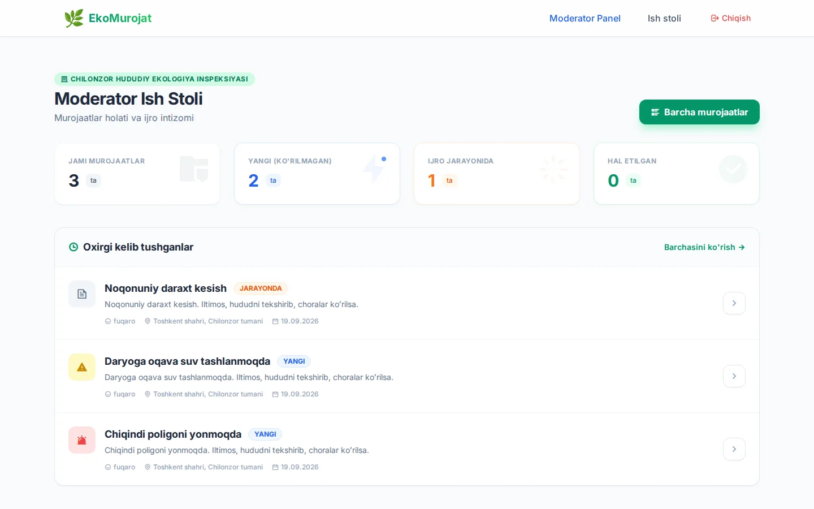
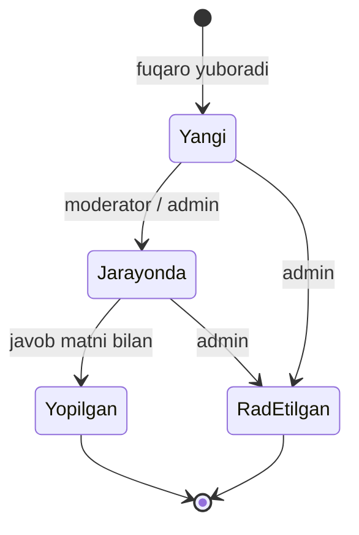
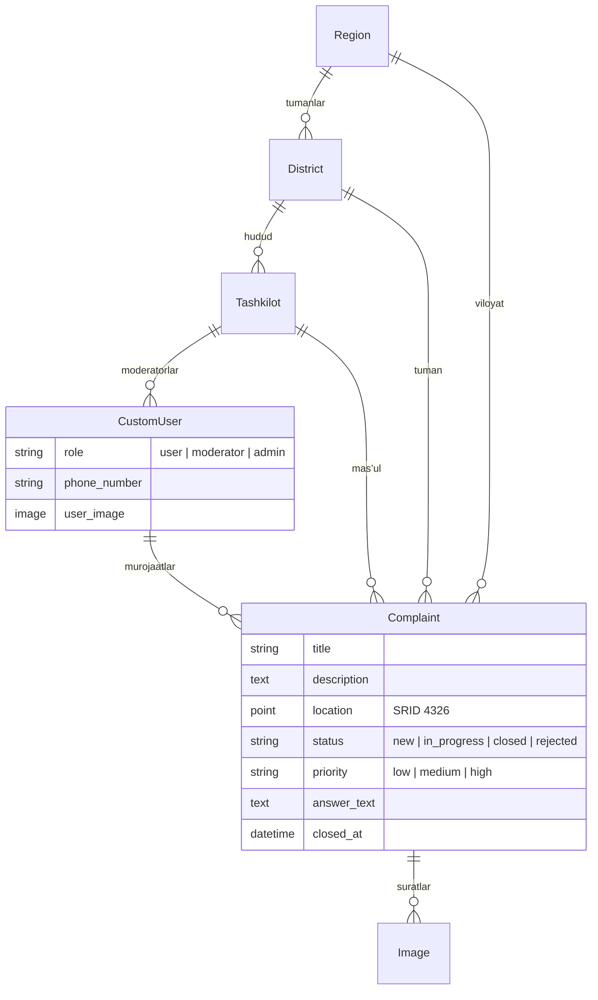

<div align="center">

# 🌿 EkoMurojat

**Ekologik muammolar boʻyicha fuqarolar murojaatlari platformasi**
Chiqindi, havo va suv ifloslanishi, noqonuniy daraxt kesish — xaritadan belgilang, holatini kuzating, mas’ul tashkilot javob qaytaradi.




</div>

---

## Mundarija

- [Muammo va yechim](#muammo-va-yechim)
- [Skrinshotlar](#skrinshotlar)
- [Imkoniyatlar](#imkoniyatlar)
- [Rollar](#rollar)
- [Murojaat hayot sikli](#murojaat-hayot-sikli)
- [Texnologiyalar](#texnologiyalar)
- [Maʼlumotlar modeli](#malumotlar-modeli)
- [Tez boshlash](#tez-boshlash)
- [Sozlamalar](#sozlamalar)
- [Loyiha tuzilishi](#loyiha-tuzilishi)
- [Rivojlantirish rejasi](#rivojlantirish-rejasi)

---

## Muammo va yechim

Fuqaro axlat uyumini, daryoga tashlangan oqava suvni yoki kesilayotgan daraxtni koʻrganda kimga va qanday murojaat qilishni koʻpincha bilmaydi; murojaat esa qaysi tashkilotga tegishli ekani va holati notoʻgʻri boʻlib qoladi.

**EkoMurojat** shu zanjirni bitta joyga yigʻadi:

1. fuqaro muammoni **xaritadan nuqta qoʻyib**, surat va tavsif bilan yuboradi;
2. administrator murojaatni koʻrib chiqadi, **muhimlik darajasini** belgilaydi va **mas’ul tashkilotga** biriktiradi;
3. tashkilot moderatori faqat oʻziga biriktirilgan murojaatlarni koʻradi, ustida ishlaydi va **javob matni bilan** yopadi;
4. fuqaro har bir bosqichni oʻz kabinetida kuzatadi; barcha murojaatlar ochiq **xaritada** koʻrinadi.

## Skrinshotlar

<table>
  <tr>
    <td width="50%"><br><sub><b>Ochiq xarita</b> — muhimlik rangida belgilar, viloyat va tuman boʻyicha filtr</sub></td>
    <td width="50%"><br><sub><b>Yangi murojaat</b> — manzil xaritadan tanlanadi</sub></td>
  </tr>
  <tr>
    <td><br><sub><b>Fuqaro kabineti</b> — murojaatlar va samaradorlik</sub></td>
    <td><br><sub><b>Administrator</b> — holat, muhimlik va hududlar kesimi</sub></td>
  </tr>
  <tr>
    <td colspan="2"><br><sub><b>Moderator ish stoli</b> — faqat oʻz tashkilotiga biriktirilgan murojaatlar</sub></td>
  </tr>
</table>

## Imkoniyatlar

**Hamma uchun (kirmasdan)**
- Bosh sahifada **Leaflet xaritasi**: barcha murojaatlar nuqta sifatida, rangi muhimlik darajasini bildiradi
- Viloyat → tuman boʻyicha filtr, murojaatlar soni
- Yuqori muhimlikdagi, hali hal qilinmagan soʻnggi 10 ta murojaat roʻyxati

**Fuqaro**
- Roʻyxatdan oʻtish **elektron pochtaga yuborilgan 6 xonali kod** bilan tasdiqlanadi (kod kiritilmaguncha hisob faol emas)
- Murojaat yuborish: sarlavha, tavsif, viloyat/tuman, **xaritadan nuqta**, bir nechta **rasm**
- Kabinet: jami / hal etilgan / jarayonda / rad etilgan va samaradorlik foizi
- Murojaatlar roʻyxati, tafsiloti (javob matni bilan), oʻchirish, profil

**Administrator**
- Dashboard: holatlar, muhimlik darajalari, viloyatlar kesimi, oxirgi murojaatlar
- Murojaatni koʻrish va tahrirlash: holat, muhimlik, **mas’ul tashkilot**, javob matni
- **Muhimlikni boshqarish** sahifasi: belgilanmaganlarni filtrlab, tez tayinlash
- Tashkilotlar va foydalanuvchilar boʻyicha CRUD (rol va tashkilot biriktirish)
- Django admin (**django-unfold**) — qoʻshimcha boshqaruv

**Moderator (tashkilot vakili)**
- Faqat oʻz tashkilotiga biriktirilgan murojaatlar: dashboard, holat boʻyicha filtr
- Holatni *jarayonda* yoki *yopilgan* qilish, javob yozish

**Qoidalar**
- Murojaatni **javob matnisiz yopib boʻlmaydi** (administrator ham, moderator ham); yopilgan vaqt (`closed_at`) avtomatik yoziladi
- Har bir rol faqat oʻz sahifalariga kiradi (`UserPassesTestMixin`), begona sahifaga urinish rad etiladi

## Rollar

| | Fuqaro | Moderator | Administrator |
| --- | :---: | :---: | :---: |
| Ochiq xaritani koʻrish | ✓ | ✓ | ✓ |
| Murojaat yuborish, oʻzinikini koʻrish/oʻchirish | ✓ | — | — |
| Biriktirilgan murojaatlarga javob berish | — | ✓ | ✓ (barchasiga) |
| Muhimlik va mas’ul tashkilotni belgilash | — | — | ✓ |
| Tashkilot va foydalanuvchilarni boshqarish | — | — | ✓ |

Kirgandan keyin rolga qarab tegishli panelga yoʻnaltiriladi: `/user/dashboard/`, `/moderator/dashboard/`, `/dashboard/management/`.

## Murojaat hayot sikli



Admin murojaatga **muhimlik** (past / oʻrta / yuqori) va **mas’ul tashkilot** biriktiradi; shundan keyin murojaat tashkilot moderatoriga koʻrinadi.

## Texnologiyalar

| Nima | Vazifasi |
| --- | --- |
| **Django 6** — class-based view'lar, Django Templates | Server tomonida render qilingan sahifalar |
| **PostgreSQL + PostGIS** (`django.contrib.gis`) | Murojaat joylashuvi `PointField` (SRID 4326) sifatida saqlanadi |
| **Leaflet** (OpenStreetMap maʼlumotlari) | Ochiq xarita va manzilni tanlash |
| **django-unfold** | Zamonaviy admin panel |
| **environs** | `.env` orqali sozlamalar |
| **Pillow** | Murojaat va profil rasmlari |
| Django `send_mail` (SMTP) | Roʻyxatdan oʻtishni tasdiqlash kodi (`secrets` bilan generatsiya) |

## Maʼlumotlar modeli



## Tez boshlash

**Talab:** Python 3.12+, [`uv`](https://docs.astral.sh/uv/), PostgreSQL **PostGIS** kengaytmasi bilan, hamda tizimda **GDAL/GEOS** kutubxonalari.

```bash
# 0. Tizim kutubxonalari (Ubuntu/Debian)
sudo apt install gdal-bin libgdal-dev libgeos-dev

# 1. PostGIS bazasi (Docker bilan eng oson)
docker run -d --name ekomurojat-db \
  -e POSTGRES_PASSWORD=postgres -e POSTGRES_DB=ekomurojat \
  -p 5432:5432 postgis/postgis:16-3.4-alpine

# 2. Bogʻliqliklar
uv sync

# 3. Sozlamalar
cp .env.example .env

# 4. Migratsiya va administrator
uv run manage.py migrate
uv run manage.py createsuperuser

# 5. Ishga tushirish
uv run manage.py runserver
```

Sayt: <http://127.0.0.1:8000> · Django admin: <http://127.0.0.1:8000/admin/>

> ⚠️ **Muhim:** `createsuperuser` yaratgan foydalanuvchining `role` maydoni `user` boʻladi. Administrator paneliga kirish uchun Django adminda (`/admin/`) uning **roli**ni `admin` qilib qoʻying. Xuddi shu joyda tashkilot yaratib, moderatorlarni unga biriktirasiz. Viloyat va tumanlar ham admin orqali qoʻshiladi.

**Roʻyxatdan oʻtish kodi.** `.env` da `EMAIL_HOST_USER` va `EMAIL_HOST_PASSWORD` (Gmail uchun *ilova paroli*) berilsa, kod pochtaga yuboriladi. Berilmasa (dasturlash rejimi), kod **terminalga** chiqadi.

`uv` oʻrniga `pip` ishlatmoqchi boʻlsangiz:

```bash
pip install -r requirements.txt "GDAL==$(gdal-config --version)"
```

## Sozlamalar

`.env.example` dan nusxa oling:

| Oʻzgaruvchi | Namuna | Izoh |
| --- | --- | --- |
| `SECRET_KEY` | — | Production'da majburiy: `python -c "import secrets; print(secrets.token_urlsafe(50))"` |
| `DEBUG` | `True` | Production'da `False` |
| `ALLOWED_HOSTS` | `localhost,127.0.0.1` | Vergul bilan |
| `DB_NAME` `DB_USER` `DB_PASSWORD` | `ekomurojat` `postgres` | PostgreSQL |
| `DB_HOST` `DB_PORT` | `localhost` `5432` | |
| `EMAIL_HOST_USER` `EMAIL_HOST_PASSWORD` | — | Ixtiyoriy: tasdiqlash kodini pochtaga yuborish (aks holda terminalga chiqadi) |

Yuklangan rasmlar `media/` papkasida saqlanadi (gitga tushmaydi), `DEBUG` yoqilganda Django orqali beriladi.

## Loyiha tuzilishi

```text
EkoMurojat/
├── config/              # settings (environs), urls
├── users/               # CustomUser (rol, tashkilot), roʻyxatdan oʻtish, kirish, tasdiqlash kodi
├── complaints/          # Complaint, Image, formalar, rolga qarab view'lar
├── common/              # Region, District, Tashkilot, ochiq bosh sahifa (xarita)
├── templates/           # base, home (xarita), login, signup + complaints/ (user_*, admin_*, moderator_*)
├── static/css/
├── pyproject.toml  uv.lock
├── IMPLEMENTATION_GUIDE.md   # rollar va formalar boʻyicha tafsilot
└── docs/screenshots/
```

## Rivojlantirish rejasi

- [ ] REST API (murojaatlarni mobil ilova uchun ochish)
- [ ] Murojaat holati oʻzgarganda fuqaroga bildirishnoma
- [ ] Statistik hisobot eksporti (Excel/PDF)
- [ ] Avtomatik testlar va Docker Compose
